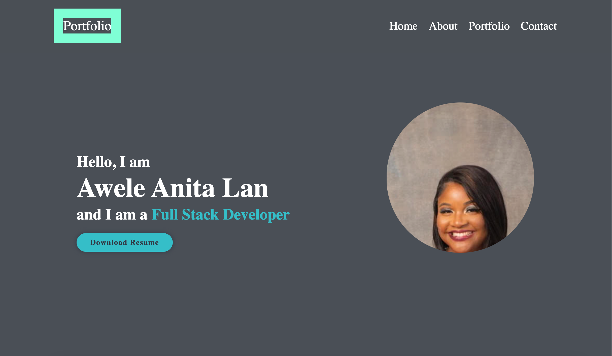
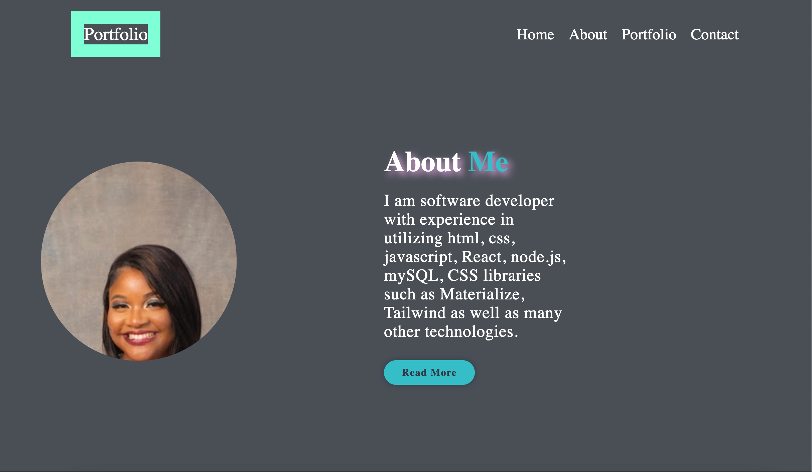
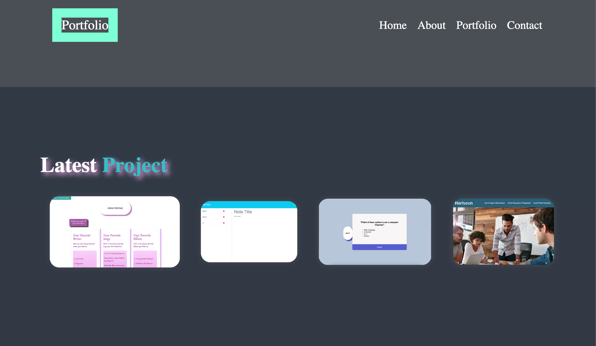
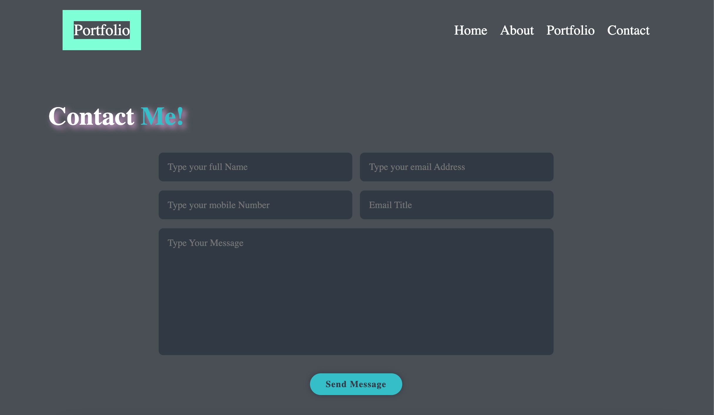

# Portfolio

## Table of Contents

- [Description](#description)
- [Installation](#installation)
- [Usage](#usage)
- [Links](#links)

## Description

Provide a short description explaining the what, why, and how of your project. Use the following questions as a guide:

My goal & motivation is to build a portfolio page with deployed projects as the course progresses. This page is able to resize  and be viewed on various screens and devices. I learned how to utilize CSS, HTML, flexbox, media queries, and CSS variables as well as Javascript in the deployment of this project.

Attached below are screenshots of my deployed portfolio website

## Installation

This page was accomplished with technologies such as Javascript, HTML & CSS. In order to add features to the application, I worked on adding additional features via javascript to make my page more user friendly & dynamic. 

## Usage
 Usage of my portfolio application is done when an employer is able to access my Resume, an about me that tells a brief description about myself and experiences. This application also enables an employer to view my completed projects via the app directly through the links. This application also allows employers to contact me through the form in the contact section.

 ##Links
 Code link - https://github.com/Awele1111/portfolio
 Demo Link - https://awele1111.github.io/portfolio/